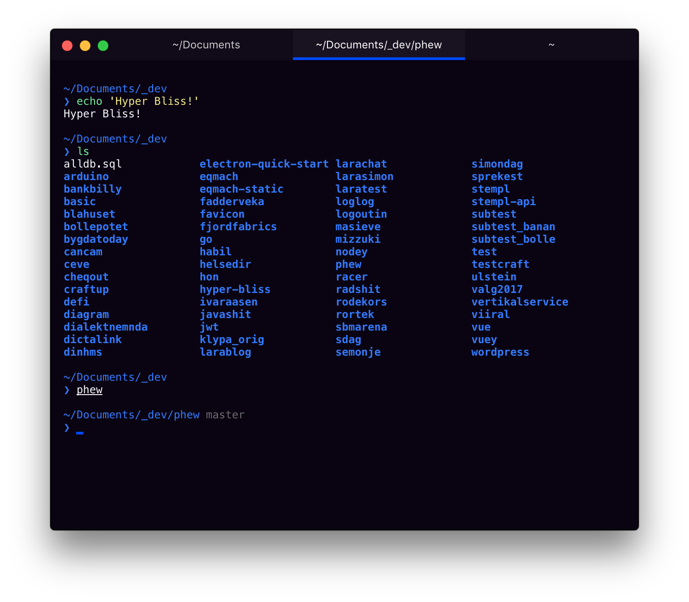

# hyper-bliss

> Happy dark theme for [Hyper](https://hyper.is)

## Install

Put `hyper-bliss` in the plugins list in your `~/.hyper.js` config file

## Misc
Using Sindre Sorhus' amazing [Pure](https://github.com/sindresorhus/pure) prompt with [zsh-syntax-highlighting](https://github.com/zsh-users/zsh-syntax-highlighting)

## License

MIT © [Simon Dagfinrud](http://simondag.no)
